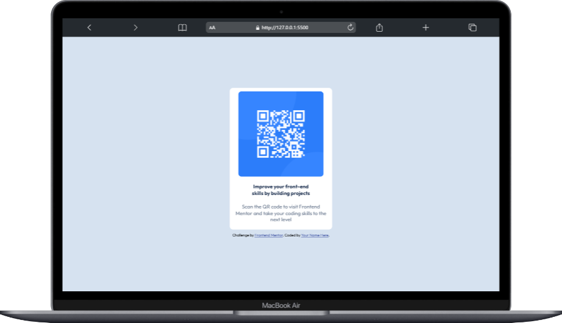
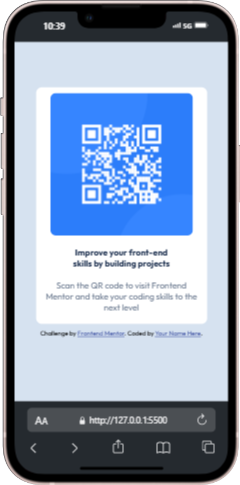

📱 <h1>QR Code Project<h1>

    Um projeto simples e responsivo deum QR Code para ser lido pelos usuários.
    Desenvolvido como prática de HTML, CSS puro.

🚀 <h2>Funcionalidades</h2>

<ul>
    <li>Mostrar QR Code para o usuário.</li>
    <li>Interface simples e responsiva.</li>
</ul>

🛠️ <h2>Tecnologias Utilizadas</h2>

<ul>
    <li>HTML</li>
    <li>CSS</li>
</ul>

📸 <h2>Demonstração</h2>

<ul>
    <li>
        Imagem de Desktop
        
    </li>
    <li>
        Imagem de Mobile
        
    </li>
</ul>

💡 <h2>Aprendizados</h2>

<ul>
    <li>Criação da estrutura com HTML</li>
    <li>Estilização responsiva com CSS.</li>
</ul>
